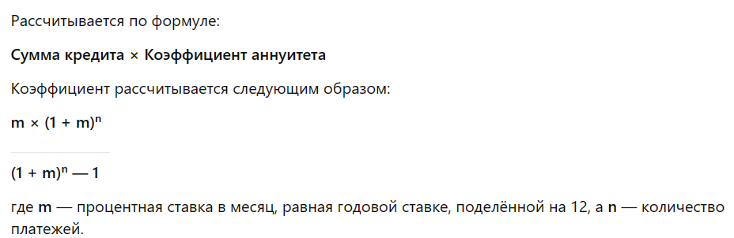

1. Сначала мы задаем значения для суммы кредита, годовой ставки и срока кредита в месяцах.
2. Затем мы используем формулу для расчета ежемесячного платежа по кредиту, учитывая годовую ставку и срок кредита. Формула основана на аннуитетном платеже, который включает как основной долг, так и проценты.
3. После того как мы рассчитали ежемесячный платеж, мы начинаем цикл, в котором для каждого месяца сначала вычисляем сумму процентов, которая зависит от оставшегося основного долга и годовой ставки.
4. Затем вычитаем эту сумму процентов из ежемесячного платежа, чтобы получить сумму основного долга, которая будет выплачена в этом месяце.
5. Остаток основного долга уменьшается на эту сумму основного долга, и таким образом мы переходим к следующему месяцу.
6. В результате получаем информацию о каждом месяце: сумма основного долга, сумма процентов, остаток основного долга.
7. Коэффицент для расчёта ежеесячного платежа  